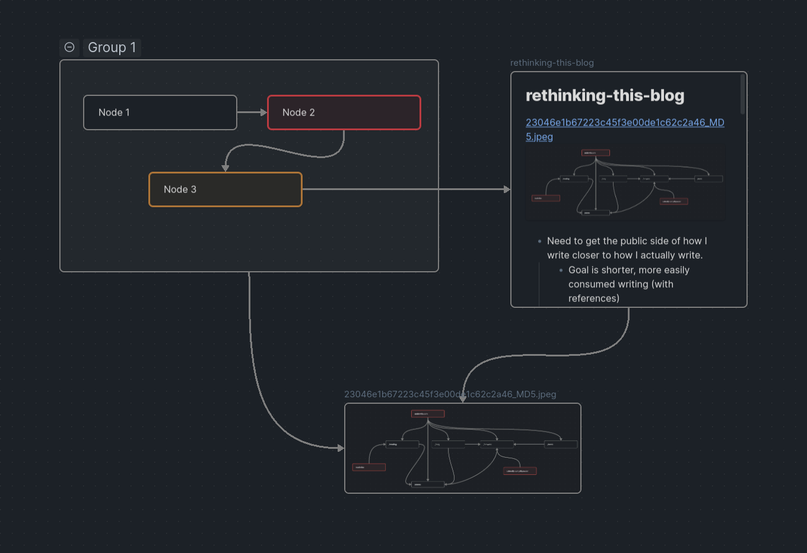
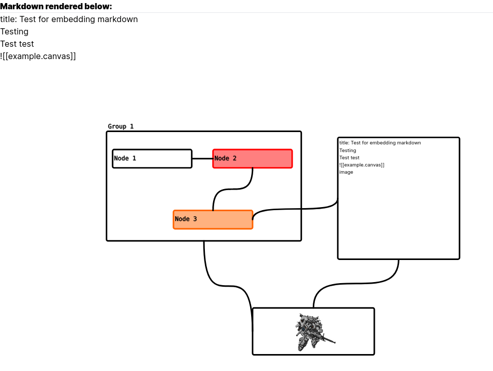

# rehype-jsoncanvas

NOTE: This project is currently in active development/prove of concept stage and isn't usable in a project. But feel free to fork, PR, or add issues if you have requests and I will respond quickly.

Its up on NPM but might not work in your environment/context. Let me know if so

Finally, I know it doesn't work on react-markdown atm because it doesn't support async plugins. I'm going to try and fix this, but suggest using the unified ecosystem directly.

## What does this do?

A rehype plugin that renders a [json-canvas](https://jsoncanvas.org/) element, probably downstream from a markdown file.

Rendered Canvas inside of Obsidian


Rendered canvas as svg on [next shims](https://github.com/lovettbarron/shims)


## Why does it do it?

Because I really like the obsidian json-canvas format, and would like to leverage it a bit more simply in my websites.

Rehype is a toolkit in the unified.js ecosystem that works to parse html trees and manipulate specific elements from those trees. It works well with Markdown and html, and so is perfect for this use case. Becuse the Obsidian ecosystem is primarily markdown, building something like this in the unified ecosystem makes sense.

## How does it do it?

Parses the html content (If it's from markdown, usually after the markdown has been translates), then renders a canvas

## Install and Use

However you use NPM, basically

```
npm i rehype-jsoncanvas
```

And then import it

```
import rehypeJsonCanvas from "rehype-jsoncanvas"
```

Then use it however you use rehype plugins.

This is an example of using Unified to render out the base.md markdown. Basically you need to process the markdown first, then transform the markdown rehype. The plugin will then look for rendered images with a .canvas extension to render out the jsonCanvas.

```js
const md = await unified()
  .use(parser)
  .use(mdast2hast)
  .use(remarkGfm)
  .use(remarkRehype)
  .use(rehypeJsonCanvas, { assetPath: "public" })
  .use(compiler, production)
  .process(markdown);
```

See [base.md](example/base.md) for an examples. A simple react app lives [in this repo](hhttps://github.com/lovettbarron/shims/tree/main/rehype-jsoncanvas) to see how it might be used.

## References along the way

- https://github.com/wujieli0207/vue-json-canvas
- https://github.com/JS-DevTools/rehype-inline-svg
- https://github.com/trbndev/jsoncanvas
- https://github.com/Digital-Tvilling/react-jsoncanvas
